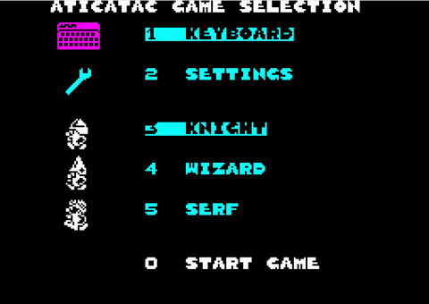

# Atic Atac — Go Replication

A faithful Go replication of Atic Atac (1983, Ultimate Play the Game) for the ZX Spectrum, built from the Z80 disassembly by Simon Owen ("obo") at [mrcook/zx-spectrum-games](https://github.com/mrcook/zx-spectrum-games/tree/master/atic-atac).



## Status

**Playable.** The full 2D game is implemented: all 150 rooms, three character classes (Knight, Wizard, Serf), all enemy types, bosses (Mummy, Dracula, Frankenstein, Devil, Hunchback), pickups, keys, doors, secret passages, trap doors, weapons, scoring, and the win condition (escape with all three ACG key pieces).

A first-person 3D view mode is included as an **experimental, alpha-quality** feature — see below.

## Build and Run

```sh
make run
```

Or directly:

```sh
CGO_CFLAGS="-Wno-deprecated-declarations" go run .
```

## Controls

### 2D mode (default)

- **Q / Up arrow** — move up
- **A / Down arrow** — move down
- **O / Left arrow** — move left
- **P / Right arrow** — move right
- **Space** — fire weapon (axe / fireball / sword)
- **Enter** — pick up item
- **Escape** — return to menu
- **=** — save screenshot
- **+** — save screenshot with state log line

### Debug / cheats (settings menu)

- **Shift+1 / Shift+2** — previous / next room (debug browse)
- **Shift+0** — jump to next key room (when KEY JUMP enabled)
- **Shift+3** — cycle secret passage rooms for current character
- **Shift+6** — toggle full-room debug map (when DEBUG MAP enabled)
- **Shift+9** — pause

### 3D mode (experimental)

- **Tab** — toggle between 2D top-down and 3D first-person
- **Up** — walk forward (in camera direction)
- **Down** — walk backward
- **Left / Right** — turn 45° (CCW / CW)
- **Shift+Left / Shift+Right** — turn 90°
- **Shift+Down** — turn 180° (about-face)
- **Space** — fire (in camera direction, supports diagonals)
- **Enter** — pick up

## Architecture

- **Headless engine** (`engine/`) with Gym-like `Step(Action) → StepResult` API for AI training
- **Ebitengine** wrapper (`game/`) for human play
- **oto** direct audio (`audio/`) for low-latency sound effects (~12ms)
- **Persistent settings** (`config/`) via JSON
- **Software 3D renderer** (`render3d/`) — separate package, doesn't touch the engine

### Layout

```
engine/    Headless game logic (collision, movement, AI, scoring)
entity/    Entity pool (creatures, items, weapons, explosions)
data/      Sprite, room, and entity data extracted from Z80
screen/    ZX Spectrum display buffer (256×192, 16 colours, attribute clash)
game/      Ebitengine application (input, draw, menus, settings)
audio/     Sound effect playback
input/     Keyboard → action mapping
render3d/  Experimental first-person renderer (alpha)
config/    Persistent settings
docs/      Implementation plan, analysis, lessons, thesis
tools/     Sprite extraction utilities
```

## 3D Mode — Experimental, Alpha Quality

The 3D mode is an experimental feature that renders the current room as a first-person view with the ZX Spectrum aesthetic preserved. **It is at an alpha level — you should expect rough edges, occasional misalignment, and visual artefacts.**

### How it works

- Software rasteriser at 192×192 (the play-area portion of the display) using the 16-colour Spectrum palette
- Wall geometry is extruded from the inner-boundary line segments of the existing 2D room style data
- Wall decorations (door arches, shields, portraits, suits of armour) are perspective-correct texture-mapped onto the wall surface
- Entity sprites (creatures, items) and the player's weapon are rendered as camera-facing billboards
- Trap doors are rendered as flat coloured patches on the floor
- Z-buffered rasterisation with near-plane edge clipping
- Camera yaw is managed independently from the engine's player direction — it is synced back to the engine each frame so weapons fire in the camera's facing direction

### Known limitations

- Decoration vertical placement uses heuristics (density-based content detection, type-based mount classification) — some sprites may appear slightly elevated, lowered, or proportionally squashed
- The wide field of view exaggerates perspective; some rooms feel disorienting
- Rooms with cave or stair styles (room style 1, 5–10) have many vertices and may render with visual noise
- Floor and ceiling are rendered as black (no textures)
- No smooth movement — the camera lerps between cardinal positions/directions
- Bosses, room transitions with falling tunnel animations, and the final room's specific visuals are not specially handled in 3D
- Performance is fine on modern hardware but the per-pixel software texture mapper hasn't been optimised

### Settings

The settings menu has a "3D VIEW" option that sets the default mode at game start. Tab toggles between modes during play.

## Documentation

- `docs/atic-atac-initial-analysis.md` — Z80 source analysis (memory layout, entity system, room map, handler dispatch)
- `docs/implementation-plan.md` — original implementation plan
- `docs/gameplay-mechanics-plan.md` — gameplay mechanics implementation
- `docs/colour-clash-option.md` — authentic colour clash vs per-pixel attribute mode
- `docs/lessons-from-manic-miner.md` — hard-won lessons from the prior project
- `docs/3d-mode-implementation-plan.md` — 3D mode design plan
- `docs/thesis/3d-mode.md` — 3D mode architecture notes

## Source Reference

- `aticatac.skool` — annotated Z80 disassembly (SkoolKit format, 14,056 lines)
- `aticatac.ctl` — SkoolKit control file
- `original/aticatac.asm` — plain Z80 assembly (12,041 lines)

## Credits

- **Original game:** Tim Stamper and Chris Stamper, Ultimate Play the Game (1983)
- **Disassembly:** Simon Owen ("obo")
- **Go implementation:** Seamus Waldron with Claude AI
